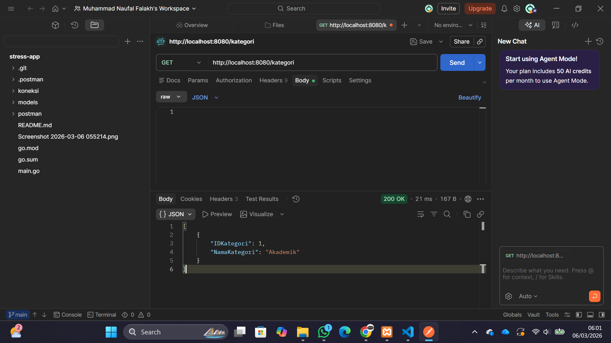

# Dokumentasi REST API - Stress App

Tugas pembuatan REST API dasar menggunakan Framework **Gin** dan **GORM**.

## 1. Persiapan Database
* Import file `db_stress.sql` yang ada di repository ini ke MySQL/phpMyAdmin.
* Sesuaikan konfigurasi database di `koneksi/koneksi.go`.

---

## 2. Dokumentasi Endpoint API

### A. Tabel Kategori
#### 1. Tambah Data (POST)
* **URL:** `http://localhost:8080/kategori`
* **Method:** `POST`
* **Parameter (Body JSON):**
    * `nama_kategori` (string): Akademik.
* **Contoh Screenshot:**

#### 2. Lihat Data (GET)
* **URL:** `http://localhost:8080/kategori`
* **Method:** `GET`
* **Parameter (Body JSON)::** 
[
    {
        "IDKategori": 1,
        "NamaKategori": "Akademik"
    }
]
* **Contoh Screenshot:**

---

